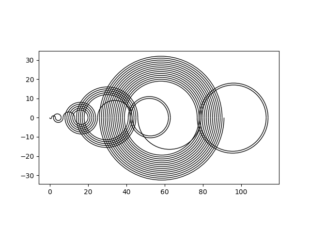

# Recamán Sequence

Calculates and visualizes the Recamán sequence up to a given point.

---

Definition:
* Start at 0
* The step size increments each time from one upwards
* No number may occur more than once
* No negative numbers are allowed
* If possible take the descending step

The begin of the sequence is: 0, 1, 3, 6, 2, 7, 13, 20, 12 ...

The steps are visualized by semi-circles alternately below and above the number line, resulting in the picture presented in [Numberphile's YouTube video](https://www.youtube.com/watch?v=FGC5TdIiT9U "The Slightly Spooky Recamán Sequence - Numberphile")

